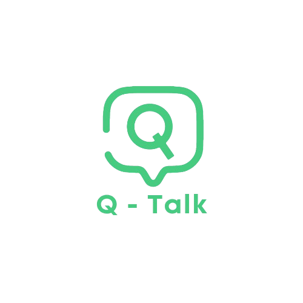

# Q-TALK: Quantum Secure Messaging App 🔒

<div align="center">



<h3 style="font-style: italic">"A next-generation secure messaging platform that prioritizes user privacy and safety"</h3>

[](https://expo.dev/)
[](https://reactnative.dev/)
[](https://www.typescriptlang.org/)
[](https://www.nativewind.dev/)
[](LICENSE)
[](http://makeapullrequest.com)

</div>

## 🎯 Project Overview

### Vision Statement

Q-TALK represents the future of secure messaging, combining quantum-inspired security with user-centric design. Our platform ensures that every conversation remains private, secure, and free from unwanted interactions.

### Main Objective

To create a user-friendly messaging app that prioritizes safety and privacy, empowering people to communicate confidently by reducing exposure to harmful content and protecting their conversations from unwanted access or misuse.

### Key Features

- 🛡️ **Advanced Message Blocking**

  - Real-time sender restriction
  - Customizable blocking rules
  - Harassment prevention system

- 👁️ **Smart Content Blur**

  - Automatic content protection
  - User-controlled visibility
  - Intelligent sender verification

- 📱 **Screenshot Prevention**

  - Native screenshot detection
  - Content protection mechanisms
  - Secure viewing modes

- 🔐 **End-to-End Encryption**

  - Military-grade encryption
  - Secure key management
  - Zero-knowledge architecture

- 🌐 **Cross-Platform Support**
  - iOS & Android compatibility
  - Consistent user experience
  - Synchronized security features

## 🚀 Getting Started

### Prerequisites

| Requirement | Version                 |
| ----------- | ----------------------- |
| Node.js     | ≥ 14.0.0                |
| npm/yarn    | Latest                  |
| iOS/Android | Development environment |

### Installation

1. **Clone the repository**

   ```bash
   git clone https://github.com/akosikhada/Q-TALK.git
   cd Q-TALK
   ```

2. **Install dependencies**

   ```bash
   npm install
   ```

3. **Start development server**
   ```bash
   npx expo start
   ```

### Development Options

| Command | Description             |
| ------- | ----------------------- |
| `a`     | Launch Android emulator |
| `i`     | Launch iOS simulator    |
| `w`     | Open in web browser     |
| `r`     | Reload application      |
| `m`     | Toggle menu             |

## 🔧 Technical Specifications

### Built With

| Technology                                                | Purpose              | Version |
| --------------------------------------------------------- | -------------------- | ------- |
| [Expo](https://expo.dev/)                                 | Development Platform | 50.0.0  |
| [React Native](https://reactnative.dev/)                  | Mobile Framework     | 0.73.x  |
| [TypeScript](https://www.typescriptlang.org/)             | Programming Language | 5.x     |
| [NativeWind](https://www.nativewind.dev/)                 | Styling Solution     | 2.0.x   |
| [React Native Paper](https://reactnativepaper.com/)       | UI Components        | 5.x     |
| [Expo Router](https://docs.expo.dev/router/introduction/) | Navigation           | 3.x     |
| [Lucide Icons](https://lucide.dev/)                       | Icon System          | Latest  |

### Tools and Technologies

#### UI Components & Design

```typescript
// Core UI Framework
import { PaperProvider, useTheme } from "react-native-paper";
import { styled } from "nativewind";

// Navigation & Routing
import { Slot, Stack, Tabs } from "expo-router";

// Animations & Gestures
import Animated, {
  FadeInUp,
  FadeOutDown,
  SharedTransition,
} from "react-native-reanimated";
import { GestureDetector, Gesture } from "react-native-gesture-handler";

// Icons & Visual Elements
import { Icons } from "lucide-react-native";
```

#### UI/UX Features

```typescript
// Theme & Styling
const theme = {
  colors: {
    primary: "#4F6F52",
    secondary: "#739072",
    background: "#D2E3C8",
  },
  typography: {
    fontFamily: "Poppins",
  },
};

// Interactive Components
const components = {
  buttons: {
    primary: styled(Pressable, "bg-primary px-4 py-2 rounded-lg"),
    secondary: styled(Pressable, "bg-secondary/10 px-4 py-2 rounded-lg"),
  },
  inputs: {
    text: styled(TextInput, "border border-gray-200 rounded-lg px-4 py-2"),
    search: styled(TextInput, "bg-gray-50 rounded-full px-6 py-3"),
  },
};

// Animations & Transitions
const animations = {
  screen: SharedTransition.custom((values) => {
    "worklet";
    return {
      opacity: values.progress,
      transform: [{ scale: values.progress }],
    };
  }),
  list: FadeInUp.delay(100),
};
```

#### Development Environment

```typescript
// Development Tools
import {
  StoryBook, // UI Component Development
  ReactDevTools, // Debugging & Inspection
  Maestro, // E2E Testing
  ESLint, // Code Quality
  Prettier, // Code Formatting
} from "@q-talk/dev-tools";

// Design System Integration
import {
  Figma, // UI Design
  ColorSystem, // Color Management
  Typography, // Font System
  Spacing, // Layout Grid
} from "@q-talk/design-system";
```

## 📚 Documentation

### Official Documentation

<div align="left">

[](./assets/docs/Q-TALK.pdf)

</div>

| Documentation Type | Description                                    |
| ------------------ | ---------------------------------------------- |
| 📖 Feature Guide   | Complete walkthrough of Q-TALK features        |
| 🔒 Security        | Detailed security protocols and implementation |
| 🔌 API Reference   | Comprehensive API documentation                |
| ⚡ Best Practices  | Development and usage guidelines               |

### Design Resources

<div align="left">

[](<https://www.figma.com/design/QR4JjEGFd7lGpKgFcCzoKT/CC106--MESSAGING--APP-(Q-TALK)?node-id=0-1>)

</div>

## Project Scope

### Core Functionality

- ✅ Secure messaging (iOS/Android)
- ✅ Privacy protection
- ✅ User controls
- ✅ Secure storage

### Current Limitations

- ❌ No offline support
- ❌ No third-party integration
- ❌ Limited file sharing
- ❌ No location sharing

## 📄 License

<div align="left">

[](LICENSE)

</div>

## 🎉 Acknowledgments

We extend our gratitude to:

- The Q-TALK development team
- Our security advisors
- The Expo and React Native communities
- All contributors and testers

---

<div align="center">

<h4>Made with ❤️ by the <span style="font-weight: 900;">Q-TALK</span> Team</h4>

</div>
